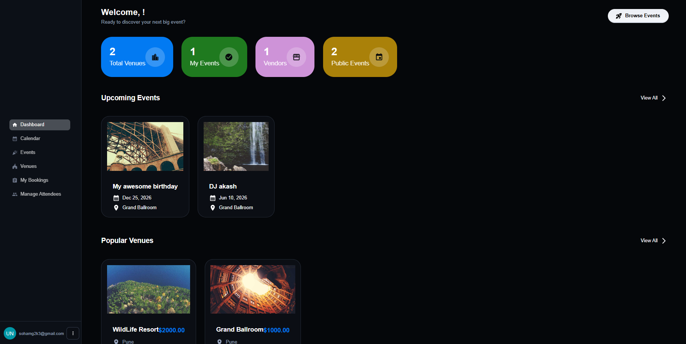
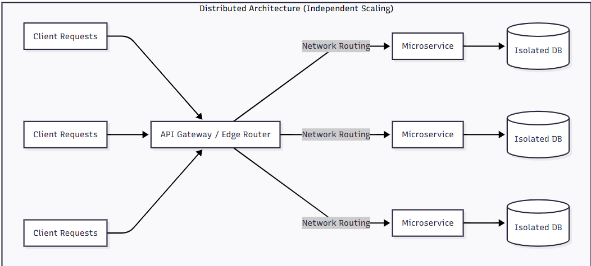
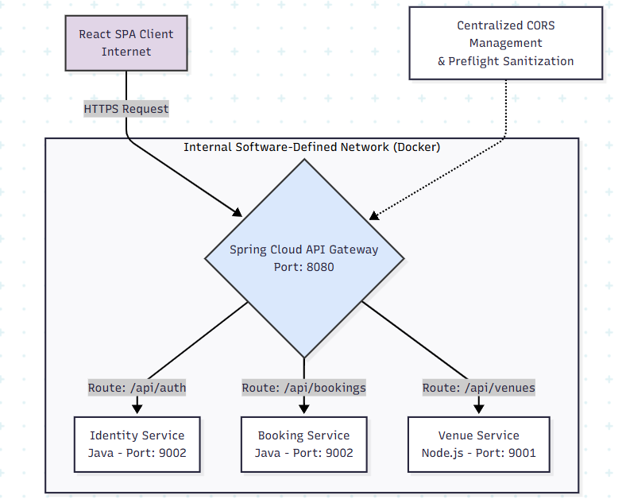
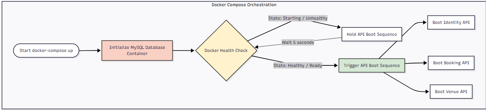
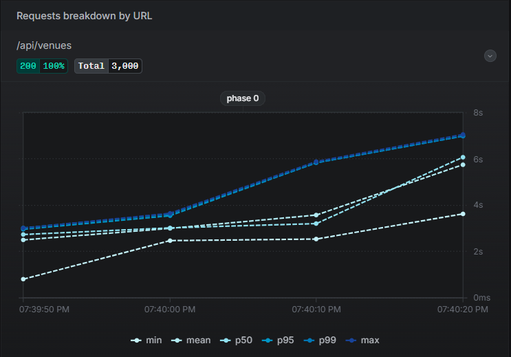
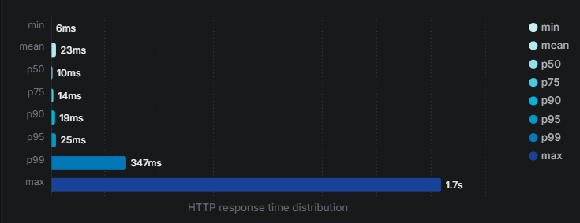
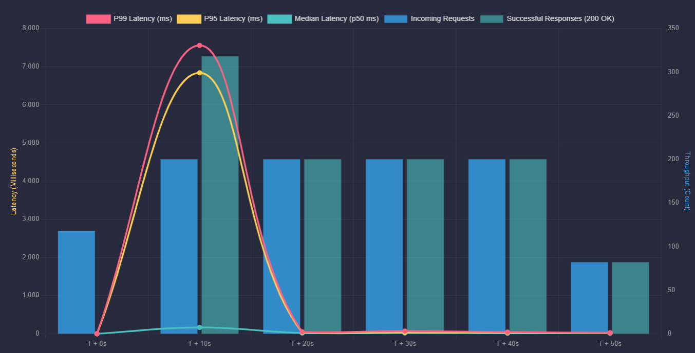

# EventZen

**EventZen** is a cloud-native, enterprise-grade event management and orchestration platform. It is designed to handle high-concurrency ticket bookings, dynamic venue management, and secure identity access while eliminating the single points of failure (SPOF) typical in monolithic applications.

## 🚀 Key Features
- **Stateless Zero-Trust Security**: Secure JSON Web Tokens (JWT) and BCrypt hashing handle identity access across all domains without maintaining server sessions.
- **Polyglot Microservices**: Combines the strict transactional safety of Java (Spring Boot) with the high-throughput asynchronous capabilities of Node.js (Express).
- **Asynchronous Messaging**: Leverages RabbitMQ to decouple services. Ticket bookings immediately return success to the user while physical capacities are updated in the background.
- **Surgical Caching**: Implements Upstash Serverless Redis to serve high-frequency catalog reads straight from RAM, bypassing disk I/O completely.
- **Native QR Ticket Scanning**: Direct browser-based camera integration (`@yudiel/react-qr-scanner`) allows event hosts to securely validate encrypted digital tickets at the door.

---

## 🏗 System Architecture

To overcome the scaling limitations of a traditional monolith, EventZen utilizes **Domain-Driven Design (DDD)**. The system is split into three strictly isolated bounded contexts.

### The Database-per-Service Pattern
To guarantee fault isolation, databases are physically separated. Cross-service data is stitched together on the client-side (React SPA) via "Logical Foreign Keys", completely eliminating the traditional database locking and massive `JOIN` bottlenecks.

### API Gateway & Edge Routing
A Spring Cloud API Gateway acts as the single edge ingress point. It masks the internal container network, handles centralized CORS policies, and validates JWT signatures before routing traffic to the internal Java or Node.js containers.

---

## 🛠 Tech Stack

### Frontend (Single Page Application)
- **React 19 & Material UI (MUI)**: Mobile-first responsive UI.
- **Axios**: Network client featuring HTTP interceptors for automatic JWT injection.

### Backend (Polyglot Microservices)
- **Java 17 & Spring Boot 3.x**: Manages the ACID-compliant Identity (IAM) and Event Booking microservices.
- **Node.js & Express.js**: Manages the high-speed, asynchronous Venue and Vendor logistics microservice.

### DevOps & Infrastructure
- **Docker & Docker Compose**: Complete containerization ensuring environment parity and strict health-check boot sequences.
- **CloudAMQP (RabbitMQ)**: Event-driven message broker.
- **Upstash Serverless Redis**: In-memory data caching.
- **Aiven MySQL 8.0**: Cloud-hosted relational databases.

---

## 📊 Performance Benchmarks

The microservice architecture was heavily stress-tested using **Artillery.io** to validate its resilience under extreme traffic loads.

### 1. The Impact of Caching (Redis)
Querying the venue database under a load of 3,000 requests caused the MySQL connection pool to saturate, inflating response times to 1.7 seconds. By serving the same data via Redis memory caching, the system dropped the response time to a flat **16.3 milliseconds** (a 99% reduction in latency).

### 2. Horizontal Scaling & Load Balancing
When a single Node.js instance was flooded with 50 concurrent requests/sec, the thread pool exhausted, creating severe tail latency spikes. By dynamically scaling the Node.js container to three instances, the Spring API Gateway round-robined the traffic, reducing the maximum latency spikes by **88%**.

### 3. Asynchronous Queue Resilience (RabbitMQ)
During a sustained 1,000-request ticket booking frenzy, the system maintained a **100% success rate** with zero socket timeouts. Instead of locking the database while waiting for transactions, the system pushed payloads to RabbitMQ and returned immediate success to users, stabilizing the HTTP response time to **~36ms** under heavy load.

